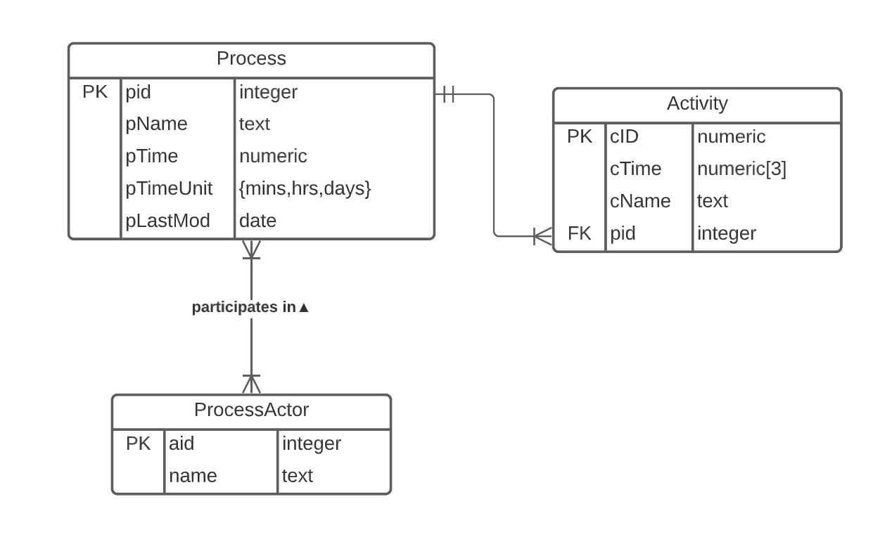
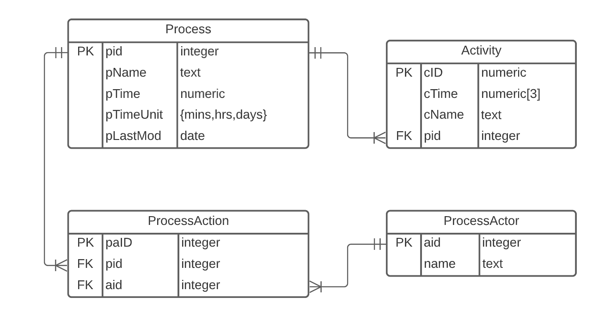
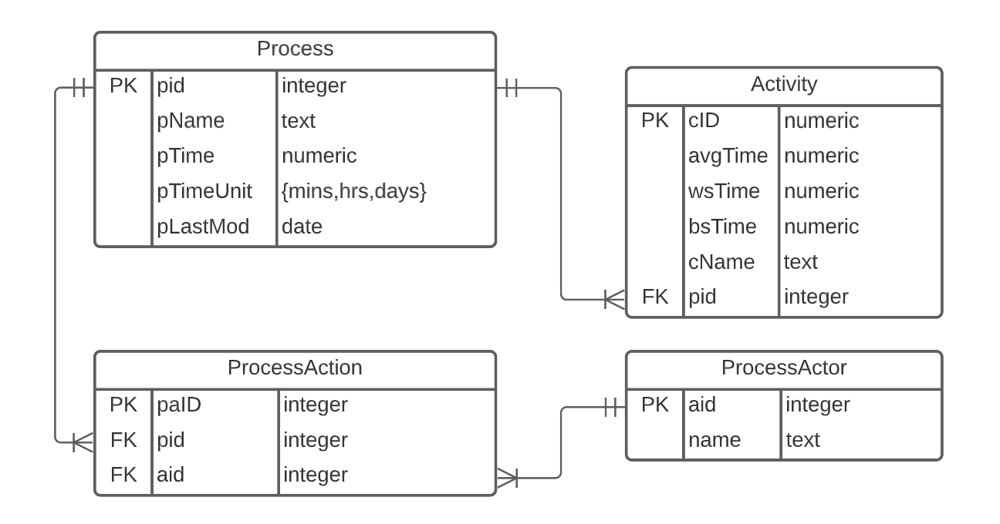
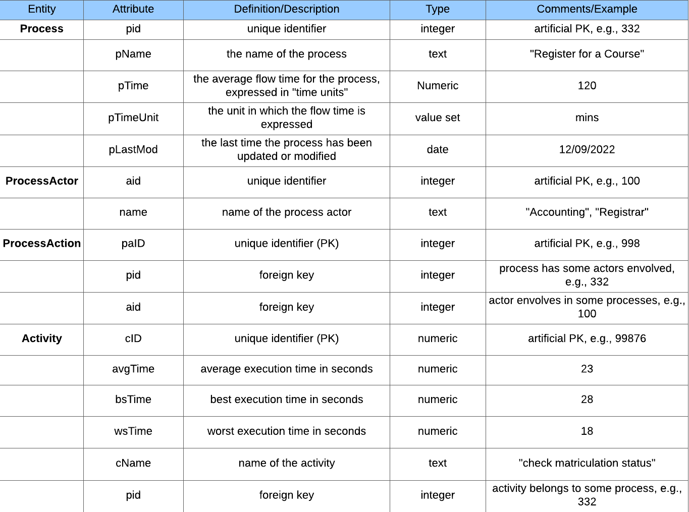

# ERD Normalization

### 1. Analysis

The provided Entity Relationship Diagram (ERD) consists of 3 relation schemas:
**Process{pid, pName, pTime, pTimeUnit, pLastMod}**
**ProcessActor{aid, name}**
**Activity{cID, cTime, cName, pid}**

To make the database normalized to 3NF, all relations should be in 3NF.

**1NF**: The domains of all attributes contain atomic values only.

**2NF**: 1F, and Every non-prime (not part of candidate key) attribute is fully functional dependent(FD) on the primary key.

**3NF**: 2NF, and every non-key attribute is non-transitively dependent on the primary key.

**1.1 Relation *Process***

According to the Glossary of Terms, pid is unique. It's not sure whether pName is unique. For any given unique pid, which represents a unique process, its name, time, time unit, and last modified date should all be determined.

**FD Set**: 
pid -> pName
pid -> pTime
pid -> pTimeUnit
pid -> pLastMod

**Candidate key**
pid

**Primary key**
pid

**1NF**: Yes. All attributes contain only single values.
**2NF**: Yes. All non-prime attributes are fully dependent on the primary (pid).
**3NF**: Yes. All non-key attributes are non-transitively dependent on the primary key (pid).

**1.2 Relation *ProcessActor***

According to the Glossary of Terms, aid is unique. It's not sure whether name is unique.

**FD Set**: 
aid -> name

**Candidate key**
aid

**Primary key**
aid

**1NF**: Yes. All attributes contain only single values.
**2NF**: Yes. All non-prime attributes (name) are fully dependent on the primary key (aid).
**3NF**: Yes. All non-key attributes (name) are non-transitively dependent on the primary key (aid).

**1.3 Relation *Activity***

According to the Glossary of Terms, cID is unique. It's not sure whether cName is unique. For a given unique cID, which represents a unique activity, its name, time, and belonged process should all be determined (because of the one-to-many relationship).

**FD Set**: 
cID -> cTime
cID -> cName
cID -> pid

**Candidate key**
cID

**Primary key**
cID

**1NF**: No. cTime contains multiple values.
**2NF**: No.
**3NF**: No.

**1.4 Conclusion**
Schema *Process* is in 3NF, *ProcessActor* is in 3NF, and *Activity* is not in any normal form. The database is not in any normal form.

By the way, the many-to-many relationship between *Process* and *ProcessActor* is not dealt with properly.

### 2. Add Join Table

A join table named *ProcessAction* is added to contain the primary keys of *Process* and *ProcessActor* as foreign keys. paID is created as the primary key of *ProcessAction*. Besides, as pid and aid are both unique foreign keys, their combination (pid, aid) can also execute as a candidate key.

**Relation *ProcessAction***

**FD Set**: 
paID -> pid
paID -> aid
(pid, aid) -> paID

**Candidate key**
paID, {pid, aid}

**Primary key**
paID

**1NF**: Yes. All attributes contain only single values.
**2NF**: Yes. All non-prime attributes are fully dependent on the primary key (paID).
**3NF**: Yes. All non-key attributes are non-transitively dependent on the primary key (paID).

### 3. Normalization to 3NF

All schemas besides *Activity* are in 3NF already.

cTime in *Activity* has multiple values which violates 1NF requirement. We will handle this first by splitting the cTime into 3 attributes: avgTime, wsTime, bsTime. And similar to cTime, they will be numeric data in seconds.

**Relation *Activity***

**FD Set**: 
cID -> avgTime
cID -> wsTime
cID -> bsTime
cID -> cName
cID -> pid

**Candidate key**
cID

**Primary key**
cID

**1NF**: Yes. All attributes contain only single values.
**2NF**: Yes. All non-prime attributes are fully dependent on the primary key (cID).
**3NF**: Yes. All non-key attributes are non-transitively dependent on the primary key (cID).

## 4. 3NF Proof

Now all schemas(tables) should be in 3NF. Let's go through all FDs again to verify this:

**4.1 FD Set of *Process***: 
pid -> pName
pid -> pTime
pid -> pTimeUnit
pid -> pLastMod

**1NF**: Yes. All attributes contain only single values.
**2NF**: Yes. All non-prime attributes (pName, pTime, pTimeUnit, pLastMod) are fully dependent on the primary key (pid).
**3NF**: Yes. All non-key attributes (pName, pTime, pTimeUnit, pLastMod) are non-transitively dependent on the primary key (pid).

**4.2 FD Set of *ProcessActor***: 
aid -> name

**1NF**: Yes. All attributes contain only single values.
**2NF**: Yes. All non-prime attributes (name) are fully dependent on the primary key (aid).
**3NF**: Yes. All non-key attributes (name) are non-transitively dependent on the primary key (aid).

**4.3 FD Set of *ProcessAction***: 
paID -> pid
paID -> aid
(pid, aid) -> paID

**1NF**: Yes. All attributes contain only single values.
**2NF**: Yes. All non-prime attributes (pid, aid) are fully dependent on the primary key (paID).
**3NF**: Yes. All non-key attributes (pid, aid) are non-transitively dependent on the primary key (paID).

**4.4 FD Set of *Activity***: 
cID -> avgTime
cID -> wsTime
cID -> bsTime
cID -> cName
cID -> pid

**1NF**: Yes. All attributes contain only single values.
**2NF**: Yes. All non-prime attributes (avgTime, wsTime, bsTime, cName, pid) are fully dependent on the primary key (cID).
**3NF**: Yes. All non-key attributes (avgTime, wsTime, bsTime, cName, pid) are non-transitively dependent on the primary key (cID).

**4.5 the Updated glossary**:

